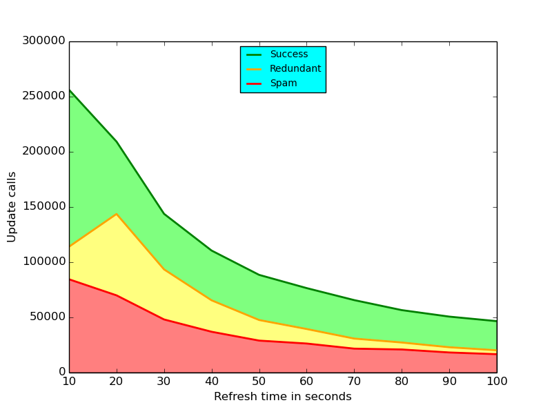
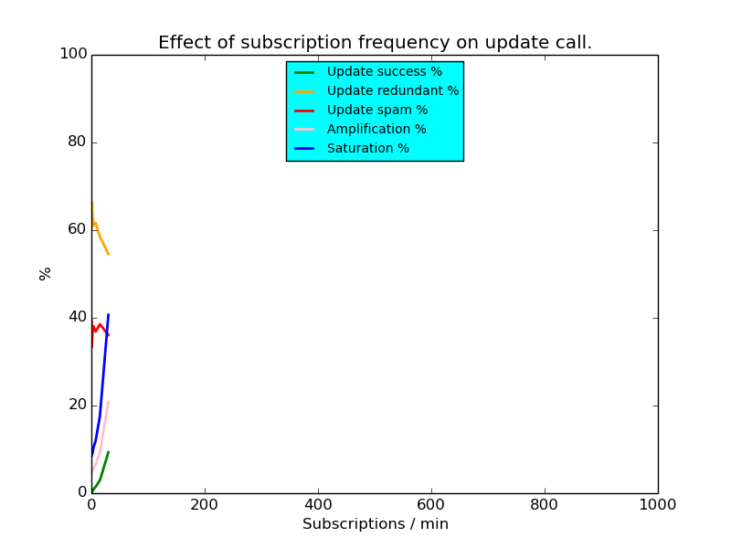
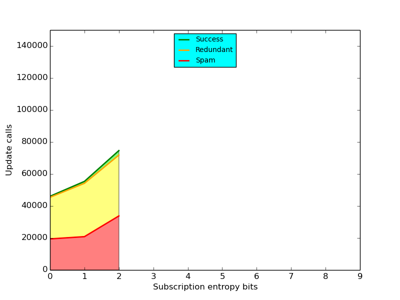
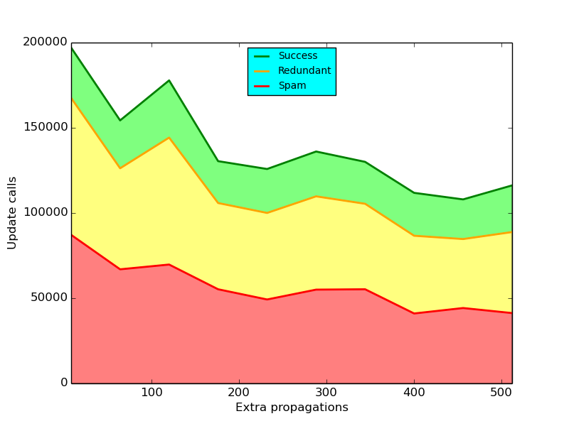
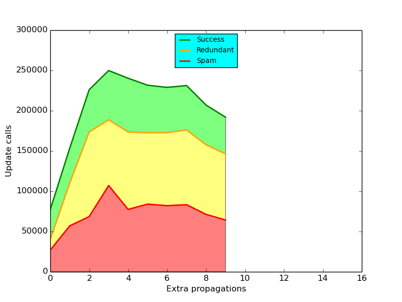

# Testing Strategy

First run quick limited tests to find out what to test extensivly.

### Mesurements

 * filter update called
 * filter update successful (filters updated and maybe propagated)
 * filter update redundant (filters not updated)
 * filter update spam (call from a peer that is not a neighbor)

## Test quasar refresh rate

Test what effect different quasar refresh rates have.
Subscriptions are to random topics from random nodes.

### Constants:

 * swarm size: 400 (theoretical maximum amplification)
 * quasar depth: 2 (limit full cascade to max 400 nodes)
 * quasar ttl: 64
 * quasar extra propagations: 10
 * test timedelta: 0.125
 * test count: 4800
 * quasar size: 512

### Varibles:

 * quasar refresh time
 * quasar freshness: quasar refresh time + 6

### Results:

### Interpretation / Observations

A larger refresh interval reduces spam as each update call has a higher
likelyhood of introducing meaningfull changes.

In the intrest of spam reduction the largest practical refresh interval
should be chosen.

## Test subscription frequency

### Constants:

 * swarm size: 400 (theoretical maximum amplification)
 * quasar size: 512 (largest possable for net rpc transfer)
 * quasar depth: 2 (limit full cascade to max 400 nodes)
 * quasar ttl: 64
 * quasar freshness: 66 (1min 6sec)
 * quasar refresh time: 60 (1min to fit in 10min test timeframe)
 * quasar extra propagations: 10

### Varibles:

 * test timedelta
 * test count

### Results:

### Interpretation / Observations

The rate of subscriptions has little overall effect. This is mainly due to
the quasar refresh rate and extra propagations being the limiting factors.

## Test subscription entropy

### Constants:

 * swarm size: 400 (theoretical maximum amplification)
 * quasar depth: 2 (limit full cascade to max 400 nodes)
 * quasar ttl: 64
 * quasar freshness: 66 (1min 6sec)
 * quasar refresh time: 60 (1min to fit in 10min test timeframe)
 * quasar extra propagations: 10
 * test timedelta: 0.125
 * test count: 4800
 * quasar size: 512

### Varibles:

 * subscription entropy

### Results:

### Interpretation / Observations

The lower the subscription entropy the less updates are propagated, as the
chance the neighboring node already has the entry is higher.

## Test quasar bloom filter size

### Constants:

 * swarm size: 400 (theoretical maximum amplification)
 * quasar depth: 2 (limit full cascade to max 400 nodes)
 * quasar ttl: 64
 * quasar freshness: 66 (1min 6sec)
 * quasar refresh time: 60 (1min to fit in 10min test timeframe)
 * quasar extra propagations: 10
 * test timedelta: 0.125
 * test count: 4800

### Varibles:

 * quasar size

### Results:

### Interpretation / Observations

The tested subscription rate is not enough to saturate the quasar attenuated
bloom filters?

## Test quasar extra propagations

Test what effect different quasar extra propagations have.
Subscriptions are to random topics from random nodes.

### Constants:

 * swarm size: 400 (theoretical maximum amplification)
 * quasar depth: 2 (limit full cascade to max 400 nodes)
 * quasar ttl: 64
 * quasar freshness: 66 (1min 6sec)
 * quasar refresh time: 60 (1min to fit in 10min test timeframe)
 * test timedelta: 0.125
 * test count: 4800
 * quasar size: 512

### Varibles:

 * quasar extra propagations

### Results:

### Interpretation / Observations

TODO
